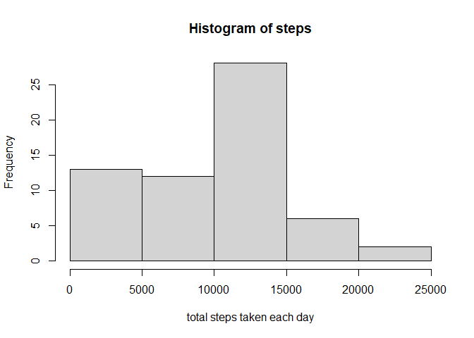
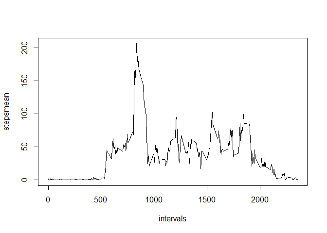
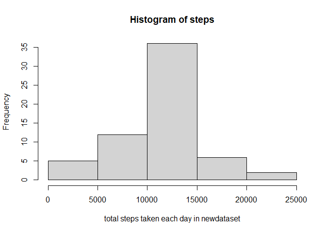
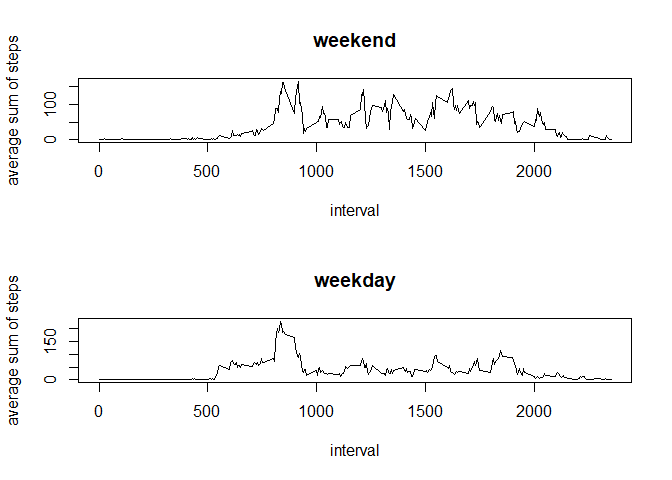

## Loading and preprocessing the data

```r
#loading the data
activity<-read.csv(unz('activity.zip','activity.csv'))
#preprocessing the data
activity[,2]<-as.Date(activity[,2],'%Y-%m-%d')
```


## What is mean total number of steps taken per day?

```r
#calculating total no of steps taken for each day
fun1<-function(dates,dataset){
 df<-data.frame()
 for(i in dates){
  singleday<-subset(dataset,date==i)
  s<-sum(singleday$steps,na.rm=T)
  df1<-data.frame(totalsteps=s)
  df<-rbind(df,df1)
 }
 df
}
dates<-unique(activity[,2])
dftotalsteps<-fun1(dates,activity)
dftotalsteps<-cbind(dates,dftotalsteps)
steps<-dftotalsteps$totalsteps
#histogram of total no of steps taken for each day
hist(steps,xlab='total steps taken each day')
```

<!-- -->

```r
#mean and median of no of steps taken per each day
mean<-mean(steps,na.rm=T)
median<-median(steps,na.rm=T)
```
Mean of the the total no of steps taken per each day is 9354.2295082  
Median of the total no of steps taken per each day is 10395

## What is the average daily activity pattern?

```r
#time series plot of 5 min interval vs avg no of steps taken in that interval
fun2<-function(intervals,dataframe){
 df<-data.frame()
 for(i in intervals){
  singleinterval<-subset(dataframe,interval==i)
  m<-mean(singleinterval$steps,na.rm=T)
  df1<-data.frame(stepsmean=m)
  df<-rbind(df,df1)
 }
 df
}
intervals<-unique(activity[,3])
dataframe5min<-fun2(intervals,activity)
dataframe5min<-cbind(intervals,dataframe5min)
plot(dataframe5min$intervals,dataframe5min$stepsmean,type='l',xlab='intervals',ylab='stepsmean',)
```

<!-- -->

```r
#finding the 5 min interval having max total no of steps on average
dfmax<-subset(dataframe5min,stepsmean==max(dataframe5min$stepsmean))
```
The 5 min interval ,on average across all the days in the datset,containing the max no of steps is 835-840  

## Imputing missing values

```r
#calculating the total no of missing values in the datset
lv<-is.na(activity$steps)
total<-sum(lv)
```
Total no of rows with NA's are 2304

```r
#filling the missing values with the mean of the 5 min interval
newdataset<-data.frame()
for(i in 1:nrow(activity)){
  row<-activity[i,]
  if(is.na(row$steps)){
    for(j in 1:nrow(dataframe5min)){
      insiderow<-dataframe5min[j,]
      if(insiderow$intervals==row$interval){
        row$steps<-insiderow$stepsmean
      }
    }
    newdataset<-rbind(newdataset,row)
  }
  else{
    newdataset<-rbind(newdataset,row)
  }
}
newdftotalsteps<-fun1(dates,newdataset)
newdftotalsteps<-cbind(dates,newdftotalsteps)
steps<-newdftotalsteps$totalsteps
#histogram of total no of steps taken for each day in the newdataset
hist(steps,xlab='total steps taken each day in newdataset')
```

<!-- -->

```r
#mean and median of no of steps taken per each day
mean<-mean(steps,na.rm=T)
median<-median(steps,na.rm=T)
```
Mean of the the total no of steps taken per each day is 1.0766189\times 10^{4}  
Median of the total no of steps taken per each day is 1.0766189\times 10^{4}

## Are there differences in activity patterns between weekdays and weekends?


```r
#creating a new factor varaible in the newdataset with two levels-weekday and weekend
newdataset$fv<-'weekday'
for(i in 1:nrow(newdataset)){
 row<-newdataset[i,]
 if(weekdays(row$date)=='Saturday'|weekdays(row$date)=='Sunday'){ 
  newdataset[i,]$fv<-'weekend'} 
 else{ 
  newdataset[i,]$fv<-'weekday'
   }
}
weekenddata<-subset(newdataset,fv=='weekend')
weekdaydata<-subset(newdataset,fv=='weekday')
weplotframe<-cbind(intervals,fun2(intervals,weekenddata))
wdplotframe<-cbind(intervals,fun2(intervals,weekdaydata))
par(mfrow=c(2,1))
plot(weplotframe$intervals,weplotframe$stepsmean,type='l',main='weekend',xlab='interval',ylab='average sum of steps')
plot(wdplotframe$intervals,wdplotframe$stepsmean,type='l',main='weekday',xlab='interval',ylab='average sum of steps')
```

<!-- -->


